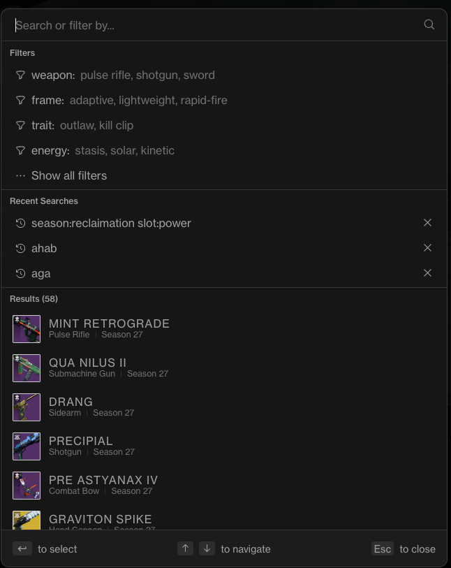

# D3 Deduper TODO

## UI Flow (Phase 4)
- [x] Show condensed weapon cards by default on "Your Weapons" page (image + Copies / Owned perks / Possible perks / Completion).
- [x] On weapon click, switch to a focused view that shows only the selected weapon’s punch-card matrix and hides all other weapons.

## Perk Matrix Columns
- [x] Fix column order to: Intrinsic Traits, Barrel, Magazine, Left Trait, Right Trait, Origin Trait.
- [x] Remove the Kill Tracker/Memento column from the punch-card display.

## Perk Deduping
- [x] Remove duplicate perks in columns 2–6 (treat enhanced perks as canonical and hide non-enhanced duplicates).

### Condensed view cards
Consider these stats
- [x] Copies
- [ ] Completion bar that tracks "desired perks" vs "owned perks" (will be 100% if have all desired perks)
- [ ] Would need concept of user-selected "desired perks" that live in state and don't go away; maybe even exported in some format for safety

### Detailed / Punch-card UI view
- [x] Demote "intrinsic trait" column to a new "Additional Details" section
  - Columns 1 - 5 are now
    - Barrel (or synonyms)
    - Magazine (or synonyms)
    - Left Traits
    - Right Traits
    - Origin Traits
- [x] New "Additional Details" section with these 2 items:
  - [x] Add "Intrinsic Trait" (Example "High-Impact Frame")
  - [x] Add "Masterwork" (Example "Masterwork: Range")
- [x] When hover over any Trait that Bungie provides a description for, show pop up text description from Bungie (example: hovering over "Attrition Orbs" trait shows "Dealing sustained power creates an Orb of Power")
- [x] Fix designation of which perks are owned
  - Currently: app shows which the aggregation of perks **currently selected** right now on weapon, not an aggregation of **all perks that exist on a weapon**

## 2026-01-02
- [x] Fix Masterwork section of "Notes" (shows "None detected")
- [x] Origin Traits > Aisha's Care > 3 origin traits owned, only "Alacrity" is highlighted

## 2026-01-03
1400L
- [x] Playground changes
  - Coverage view
    - Perk Matrix section
      - [x] Missing "Origin Traits" column
      - [x] Missing "Masterwork" column or selection
      - [x] Only showing a small subset of all perks; the idea of this section is show ALL available perks for a weapon just like the Punchcard view; then when the user clicks on a particular perk in the perk matrix section, the individual instances that contain that perk should be highlighted in the Instances section on the right (you have this interaction correct already with "Simple Highlight" and "Segmented Bars" visualization modes)
    - Instance section
      - [x] Remove the descriptors in parentheses (PVP, PVE, etc.) for each instance
      - [x] Use "Roll 1" and "Roll 2" instead of "A" and "B" (numbers instead of letters)
      - [x] For each instance, show the full "perk matrix" of that instance (show all 6 columns and however many rows needed); but keep the font size small so it doesn't take up too much space just like you have it now
  - God Roll view
    - [x] Change "Target Definition" section name to "God Roll Selector"
    - [x] Same as Coverage view, only showing a small subset of all perks; the idea of this section is show ALL available perks for a weapon just like the Punchcard view
    - [x] Change "Matches" section name to "Your Owned Rolls"
      - [x] Remove the descriptors in parentheses (PVP, PVE, etc.) for each instance
      - [x] Use "Roll 1" and "Roll 2" instead of "A" and "B" (numbers instead of letters)
      - [x] For each instance, show the full "perk matrix" of that instance (show all 6 columns and however many rows needed); but keep the font size small so it doesn't take up too much space just like you have it now
    - [x] "Save Profile" button doesn't work
    - [x] Need a "Saved God Rolls" section that shows all saved profiles below the current sections / bottom of the page
      - [x] On the right of each saved profile, add an "Edit" and "Delete" button
      - [x] When the user clicks "Edit", switch to the God Roll view and load the selected profile
      - [x] When the user clicks "Delete", remove the selected profile from storage

1440L
- [x] Overall
  - [x] Anonymous Autumn (Sidearm) perk matrix is not accurate - see JSON file at https://data.destinysets.com/i/InventoryItem:1051949956?lang=en
  - [x] Not sure if innacurate perk matrix is due to just being a quick mockup or if it's a bug
- [x] Coverage view
  - [x] Instance section
    - [x] Each instance should show the full "perk matrix" of that instance (show all 6 columns and however many rows needed); but keep the font size small so it doesn't take up too much space just like you have it now
- [x] God Roll view
  - [x] Save Profile button doesn't work: I can see a browser confirmation window pop-up for a split second but then it disappears
  - [x] Rename button to "Save God Roll"

1502L
- [x] I want to clarify there will be 3 views in the Detail View
  - [x] Overview View - the default view now in the main app showing simple highlighted perk matrix if any instances owned contain any perks
  - [x] Coverage View - as described in Playground
  - [x] God Roll View - as described in Playground
  - [x] So I want a total of 3 views in the Detail View, with the ability to switch between them
- [x] God Roll View
  - [x] Delete button doesn't work - shows quick popup then pop-up disappears
  - [x] Saving a new God Roll rofile overwrites the existing profile; it doesn't add a second or third profile etc.

2026-01-04
2026-01-04 - 1251L
- [x] Add current punchcard UI / "Overview" view to playground to make sure AI knows I want to preserve it
  - [x] So 3 total views in Weapons Detail View: Overview, Coverage, God Roll

2026-01-04 - 1315L
- [x] Merge playground into main app on a separate branch
  - Desired end state: 
    - Main app has 3 views in Weapons Detail View: Overview, Coverage, God Roll
      - Overview = current Weapons Detail View in main app, no conversion needed from Playground
      - Coverage = Coverage View from Playground converted for Vue / Vercel use
      - God Roll = God Roll View from Playground converted for Vue / Vercel use

2026-01-04 - 1336L
- [x] Refine branch structure
  - [x] Overview tab - no changes needed
  - [x] Coverage tab: Change name to "Perk Coverage"
  - [x] God Roll tab: 
    - [x] And / Or button descriptions: I'm thinking I want to simplify the intent. Let's call "And" → "Mandatory" and "Or" → "Optional". I think that accomplishes the same intent as the previous description but in a much simpler way. Keep the click & shift click behavior the same.
    - [x] "+New Profile" should be renamed "Clear Perks" to better reflect what it does 
    - [x] As I understand it now, we've removed the "Load Profile" buttonwhioch makes sense. To load the profile they simply click on the profile name in the "Saved God Rolls" section. To clear the profile, they click on the "Clear Perks" button. Is that correct?
    - [x] Update Profile UI: change "Save Copy" to "Save as New God Roll" and change color to green

2026-01-04 - 2048L
Thoughts on use cases

When playing Destiny 2 I want to know:
- how many copies I have?
- do I have "coverage" of the perks I tend to want?
- did I get a God Roll yet? 
  - self-made God Roll (via in-app God Roll profile maker)
  - curated God Roll (from DIM wishlists or streamer picks)?
  - If so notify me

When managing Inventory I want to know:
- did I get a God Roll yet? (see above)
- If not, what's the "best" roll I have so far
  - for a selected God Roll, which current roll most closely matches it
  - example: best roll has 4 of the 5 perks required on selected God Roll
- Be able to dedupe all lesser rolls to clean up inventory
  - Mark best roll as "locked"
  - Mark others as "unlocked"

2026-01-05 - 2010L
  - [x] Weapons Detail view > Overview: move "owned Perks" & "Possible Perks" stats up to top, next to Thumbail & Weapon name so it's there for all visualization modes & standardized
  - [x] Weapons Detail view
    - Perk Matrix isn't showing owned perks on any of 3 visualization modes
    - when hover over perk matrix, the perk and corresponding instances it exists on should be highlighted
    - Segmented bars visualizarion - only showing for Origin trait column

2026-01-05 - 2220L
- [x] Trait tool tips / descriptions when hover over in Perk Matrix as well as Intrinsic Trait in "Notes" section ("Lightweight frame" etc.)
- [ ] Consider "Clarity" enhanced tooltips in future (gives percentages, etc)
- [x] Search bar & filters: how hard to implement something like "Search or Filter by" bar in https://d2foundry.gg/
    - 
    - [x] Cache past inputs for quicker re-entry like her "Recent Searches" section in image?
    - Filters: Weapon Type, Frame, Trait, Energy, Ammo, Slot, Rarity, Source, Season, Foundry, RPM, Craftable
      - Note: filters would be like 6-9 hours work per Claude. Don't need it. Simple sorting by most # of copies is most effective

    

